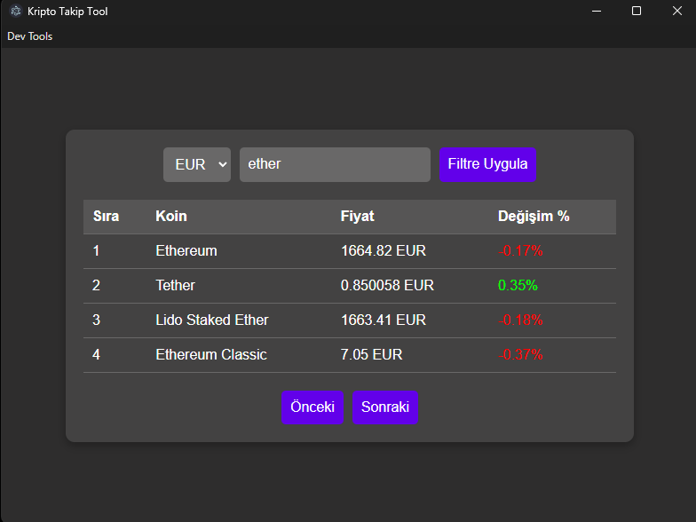

# Kripto Takip Uygulaması

Bu proje, popüler kripto paraların güncel fiyatlarını ve son 24 saatlik değişimlerini gösteren basit bir masaüstü uygulamasıdır.

Uygulama Electron ile arayüz olarak çalışır ve Python (Flask) ile yazılmış bir backend üzerinden CoinGecko API'den veri çeker.

## Özellikler

- Seçilen para birimine göre kripto fiyatlarını listeleme  
- Son 24 saatlik değişim yüzdesini gösterme  
- Electron tabanlı masaüstü arayüz  
- Python Flask ile API üzerinden veri çekme  

## Kullanılan Teknolojiler

- Python (Flask)  
- Electron  
- JavaScript  
- Axios  
- CoinGecko API  
- HTML / CSS / Bootstrap  

## Ekran Görüntüsü



## Nasıl Çalıştırılır?

### Backend başlatma

```bash
python backend.py
```

Backend varsayılan olarak `http://localhost:1337` adresinde çalışır.

### Electron uygulamasını başlatma

```bash
npm install
npm start
```
